 

 

> **MediFlow HMS**: A multi-tenant hospital management SaaS: doctors, patients, appointments and operations in one platform.

 

 

## Screens

Animated illustrations of the real screens (redrawn as vector graphics for this showcase).

 <b>Landing</b>

 <b>Platform features</b>

 

## Tech stack

## About this repository

This repository is a **showcase** of MediFlow HMS: a README, screenshots and diagrams only. The source code is private.
You can use the live project at **[hospital-management-fe-psi.vercel.app](https://hospital-management-fe-psi.vercel.app)**.

Built by **[Sushant Kumar](https://www.linkedin.com/in/sushant-kumar-bb067b128/)** · [GitHub profile](https://github.com/Sush-Singh)
